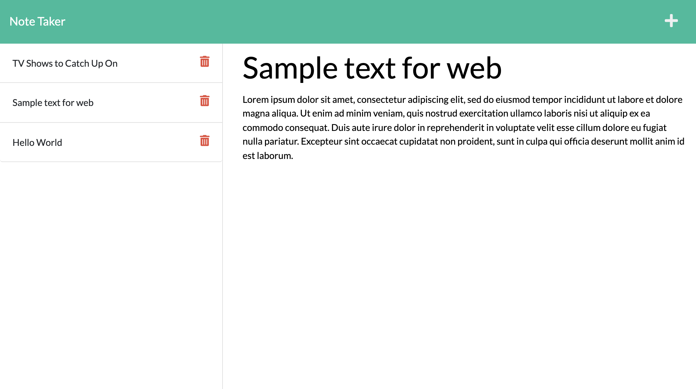

# Note Taker
Using Express with node.js and deplyed on Heroku, this note taker application allows users to create, edit, and delete notes that can be viewed across different browsers or devices. The data is saved into an API, which is updated whenever a user interacts with it. Previous notes can be accessed on the left-hand column, with the most recent note at the top.

# View Live Page
[View the live Note Taker page with Heroku.](https://note-taker-jcolecodes.herokuapp.com/)

# Screenshot
